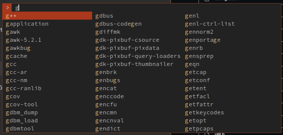

# Welcome to my personal build of dmenu

This program is customized by editing the source code directly, because we don't like 
doing things the easy way. Luckily there is a large collection of user submitted patches
available on the [suckless website](https://tools.suckless.org/dmenu/patches).

My build is considerably different from the default experience, and depends on some minor 
changes in dwm. The `managed`, `center` and `gridnav` patches are combined, along with an 
always floating and centered rule in dwm to make dmenu a fully interactive, floating 
window, that can thus be resized and moved. The `center` patch is only used to provide 
a smaller default window size. 

You might also like passmenu. I made some tweaks to it, to spawn a tiny floating terminal 
window for typing the master password into `pinentry-curses`. Using dmenu as a pinentry 
program would be a nice quality of live improvement. You can find it 
[here](https://github.com/raymon-roos/scripts/blob/main/passmenu).

## Preview

### Patches applied are (in no particular order): 
> - [center][1] Makes demu spawn in the middle of the screen.
> - [managed][2] Removes dwm exception for dmenu, allows it to be moved and resized at 
>   will.
> - [grid][3] Print entries in multiple columns. 
> - [gridnav][4] Allow moving sideways from column to column. 
> - [listfullwidth][5] The color promp part of this patch makes no sense and is not used.
> - [prefixcompletion][6] Makes tab behave more like expected, only completing up to the 
>   final common character between all remaining entries, rather than filling out the 
>   selected entry entirely and consequently losing all other entries.
> - [highlight][7] Add additional highlight colour parts of the entries matching the 
>   input.

[1]: https://tools.suckless.org/dmenu/patches/center/
[2]: https://tools.suckless.org/dmenu/patches/managed/
[3]: https://tools.suckless.org/dmenu/patches/grid/
[4]: https://tools.suckless.org/dmenu/patches/gridnav/
[5]: https://tools.suckless.org/dmenu/patches/listfullwidth/
[6]: https://tools.suckless.org/dmenu/patches/prefix-completion/
[7]: https://tools.suckless.org/dmenu/patches/highlight/

# Original readme continues below: 

dmenu - dynamic menu
====================
dmenu is an efficient dynamic menu for X.

Requirements
------------
In order to build dmenu you need the Xlib header files.

Installation
------------
Edit config.mk to match your local setup (dmenu is installed into
the /usr/local namespace by default).

Afterwards enter the following command to build and install dmenu
(if necessary as root):

    make clean install

Running dmenu
-------------
See the man page for details.
